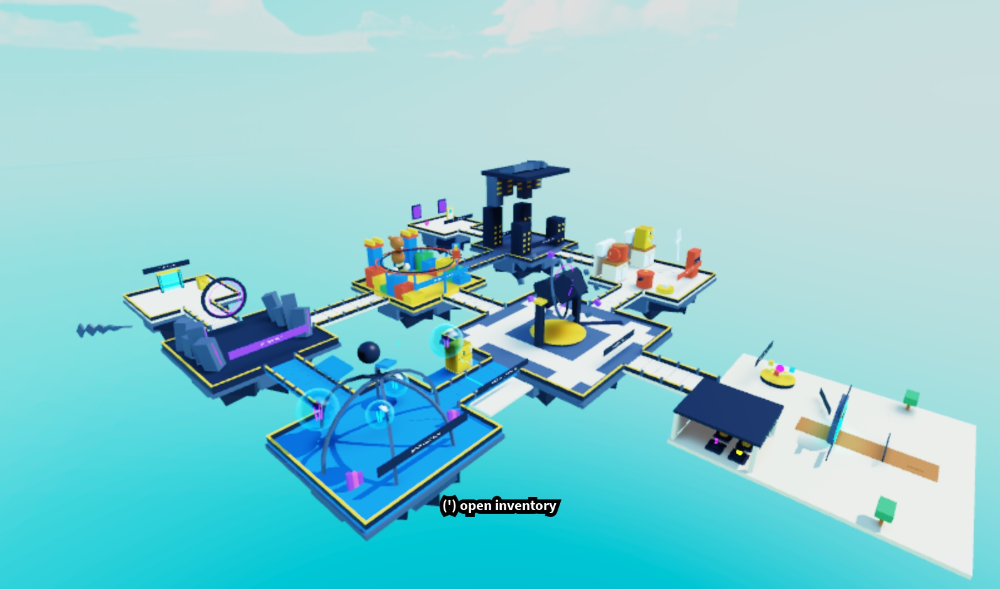
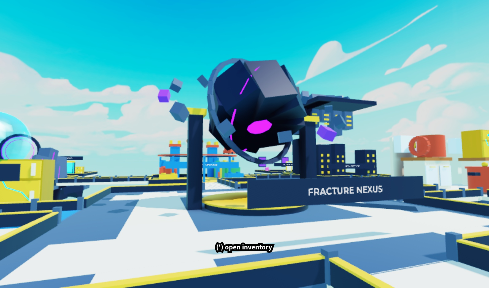
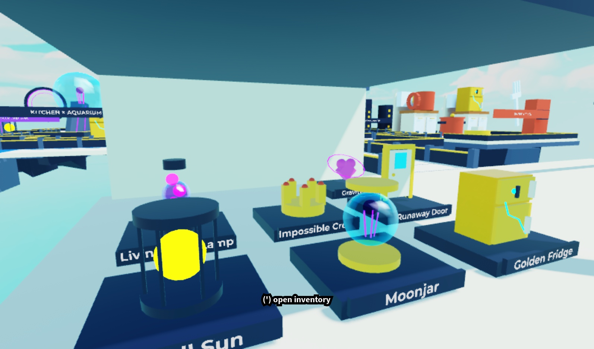

# Dimension Bible → Roblox map

The user requested “make them into the game” and “illustrate the map on roblox studio.” This extends the earlier Phase 1 scope with an explorable visual map. It does not implement the entire master blueprint.

The map uses native editable Roblox Parts, WedgeParts, models and SurfaceGui labels. No paid generation, marketplace imports, textures, mesh IDs or audio were added in this pass. `VisualKit.lua` authors the seven artifact silhouettes; `NexusBuilder.lua` authors the world composition. Both are included in the offline Command Bar distribution.

## Reference translation

| Reference | In Studio |
|---|---|
| A — Hero overview | Core island, themed clusters, fractured foundations and broad connecting bridges |
| B — Kitchen × Aquarium | Warm/cool balconies, golden refrigerator, bounded floating water and jellyfish beside the dry path |
| C — Core chamber | Faceted dark Core, violet heart/seam, containment ring, opposed pylons and two side promenades |
| D — Deep Fracture | Dark obelisks, restrained violet seams, caged Small Sun and a visible return route |
| E — Extraction | Stable cream deck, cyan gate and broken side-deck geometry; functional return-to-museum prompt |
| F — Room between dimensions | Ivory island, wheeled Runaway Door, Gravity Heart and quiet framed windows |
| G — Hub / Atlas | Circular portal arch, Atlas table, trees and level-access artifact gallery |
| H — Hybrid artifacts | Golden Fridge, Moonjar, Small Sun, Runaway Door, Impossible Crown, Living Lava Lamp and Gravity Heart |

The supplied boards additionally guide the Moon Aquarium whale/dome, Toybox train/bricks/teddy/castle, and inverted City skyline. The railway and suspended buildings are scenery; their surfaces do not imply additional playable routes.

## Layout and editing

`Workspace.OddvaultWorld.DimensionMap` contains independently atomic region and bridge models. The hub remains persistent for expedition returns. All main promenades sit at floor Y = 0, separate from the remote procedural Rift cells at ±1536 studs.

| Region | Centre X / Z (studs) | Deck |
|---|---:|---:|
| Fracture Nexus | 0 / 320 | 224 × 224 |
| Giant’s Kitchen | -288 / 320 | 160 × 160 |
| Moon Aquarium | 288 / 320 | 160 × 160 |
| Toybox Catastrophe | 0 / 608 | 160 × 160 |
| Upside-down City | -288 / 608 | 160 × 160 |
| Deep Fracture | 288 / 608 | 160 × 160 |
| Kitchen / Aquarium crossover | 160 / 320 | Bridge plus side balconies |
| Room Between Dimensions | -288 / 848 | 128 × 128 |
| Extraction | 288 / 848 | 128 × 128 |

Walk behind the museum to reach the Core. Kitchen and Aquarium connect laterally; the northern loop links City, Toybox and Deep Fracture. Rare room and extraction extend from that loop. The original hub portal still starts the separate procedural Kitchen expedition.

Standard bridges have 36 studs between their collision rails; the hub bridge has 44. The Core’s side promenades are 32 studs wide. Native clearance checks use a smaller 24 × 24 proxy, leaving turning/edge margin. Decorative geometry is anchored and non-colliding; structural decks, bridge rails, gallery pedestals and the Core dais collide.

Change map recipes in source and rebuild the distribution. A reinstall archives the five previous owned roots, including Studio edits. `SetLighting` at the top of the installer selects daylight; disable it to preserve the place’s lighting. Previous values are saved as `PreviousLighting_*` attributes on the installed world. The optional standalone Rojo project builds the same geometry on startup.

## Validation

The exact installer ran through the official Studio MCP in the isolated test place and then the main GRAB THE WEIRD! place (87112781126474). Nine region models, seven museum artifacts and 1,028 map BaseParts were measured in Studio. All map BaseParts are anchored. The main place’s original Baseplate and SpawnLocation are preserved in `ServerStorage.OddvaultBackups.SceneBeforeDimensionMap_*`.

The native check in `tools/studio/validate_nexus.lua` samples 383 positions across five promenade routes. Its 3,447 floor rays found no holes, and its 24 × 24 × 24 clearance boxes found no colliding blockers. This measures the specified static routes, not a physical carry simulation or every decorative corner.

The existing compiler, pure-module analysis, bundle parity, 4,029 planner/allocator invariants and 47,865 engine-double checks pass. The core gate also passes formatting, lint, Rojo build, 116 tests and content validation. Full engine-aware type analysis is still skipped because Roblox definitions are unavailable.

Fifteen native character-navigation steps at normal speed reached the illustrated areas with the character alive. The client’s actual ProximityPrompt hold API activated extraction and returned it to `(0, 3, -60)`. The keyboard-input attempt did not activate while the viewport was focused on Server; keyboard activation is not claimed as verified. Native walkthrough, final installation and screenshots are recorded in [validation/nexus-map-evidence.json](validation/nexus-map-evidence.json).

## Reopen the map directly

Open [assets/OddvaultDimensionMap.rbxl](../assets/OddvaultDimensionMap.rbxl) using Studio’s Open from File, then press Play. It contains the actual exported geometry and all thirteen current scripts. It is a standalone map package; the main project’s existing systems remain separate.

[assets/OddvaultDimensionMap.rbxm](../assets/OddvaultDimensionMap.rbxm) is the native geometry model, useful for importing or editing the scene. It contains the world and preview, without the separately installed server/client source roots. Use the Command Bar installer for the complete installation.

The Studio export dialog stalled. The geometry was recovered through Roblox’s documented [SerializationService](https://create.roblox.com/docs/reference/engine/classes/SerializationService), then deserialized by the engine to verify its round trip. The model is 52,993 bytes; the place file is built with `rojo build map.project.json -o assets/OddvaultDimensionMap.rbxl`. Lune verifies nine regions and all thirteen exact script sources in the binary. The complete place file has not been reopened through Studio’s UI; the same geometry/runtime were tested in the already-open test place. Hashes and provenance are in [assets/nexus-map-manifest.json](../assets/nexus-map-manifest.json).

## Remaining gameplay work

The map is an explorable illustration with a return prompt. Museum displays have no collectible ownership, rewards or saved state. Special gravity, water locomotion, moving trains, timed collapse, active hazards, physical carrying, multiplayer acceptance and mobile performance remain unimplemented or unverified. The scene has not been published to Roblox live servers.
