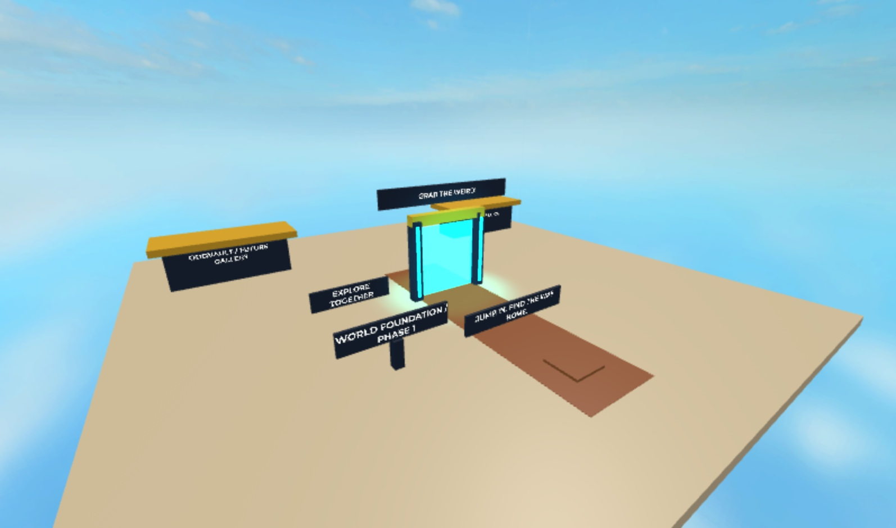
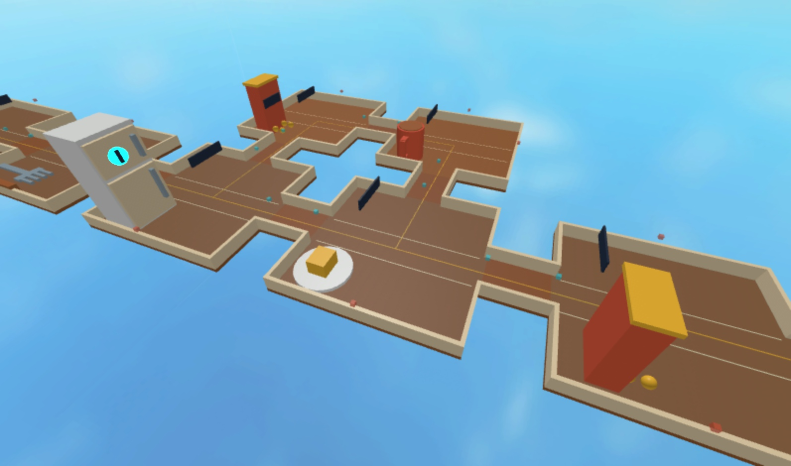

# Phase 1 validation

Date: 5 October 2026. Luau toolchain: official 0.741 release.

## Completed automated checks

- All source modules, scripts, generated installer and test files compile with `luau-compile --null`.
- Pure planner, allocator and definitions pass strict `luau-analyze`. Roblox-aware engine type analysis was not performed; strict declarations/public signatures and the dynamic boundary are documented in ADR 0007.
- StyLua 2.5.2 and Selene 0.32.0 checks are clean. Rojo 7.7.1 builds `world.project.json` to a standalone place file.
- The merged main foundation's full check command passes formatting, lint, default Rojo build, 116 core tests and content validation. Its Roblox-aware type step printed SKIPPED because type definitions were unavailable; that step is not counted as verified type safety.
- Checked-in Command Bar bundle and SHA-256 manifest exactly match their source files.
- 1,000 seeds reproduce identical fingerprints on replay, form connected eight-room graphs, preserve extraction/cargo paths and produce 18 tested template/branch compositions.
- Negative graph checks reject overlaps, missing entry/landmark/extraction connectivity, bad socket opposition, narrow connectors, duplicated edges and false route metrics.
- Engine-double execution runs the **exact generated installer** and creates/validates all seven authored templates.
- 100 assembled maps contain the expected eight room floors/eight connector floors, with no intersecting floor footprints and zero unanchored physics parts or live artifacts.
- Template rejection checks cover actual cargo-lane obstruction, missing collision floor, inward sockets, narrow sockets and missing landmark.
- Four concurrent reservations are isolated. Exhaustion, stale lease tokens, failed generation, complete teardown and cell reuse are checked.
- Simultaneous main-portal requests reserve separate destinations while clients are still streaming; the join station can share the oldest open expedition. Pending-entry cancellation releases both maps and transitions.
- Transition checks cover forged tokens, distant extraction, destination timeout/failure, movement restoration, successful entry/return, closure during streaming and last-occupant cleanup.
- Installation rerun archives all five owned roots including template edits, preserves unrelated content, rejects foreign name collisions and leaves no staging folder.

These are executable source-level and engine-double checks. The double implements enough Instance/vector/CFrame behavior to exercise the authored geometry and services. It does **not** validate engine permissions, actual player/network physics, streaming arrival, rendered art, mobile memory/frame rate, or whether a first-time player finds the game fun.

## Completed Studio MCP checks

Earlier native UI attempts stalled. After the user requested Roblox Studio MCP, the already configured official `StudioMCP` executable connected successfully (MCP server version 1.0.0). It listed both the published main place and the isolated `OddvaultCommandBarTest.rbxl`; all test writes targeted the unpublished test place (`PlaceId=0`). The exact Git distribution executed through MCP `execute_luau` in Edit mode. Evidence is in [studio-phase1-evidence.json](validation/studio-phase1-evidence.json).

- [x] Installer executed with real Studio Source-writing permissions; seven templates validated, seeded preview created, streaming enabled and prior owned installation archived.
- [x] Play bootstrap produced one initial Rift, persistent hub, server debug actions and client UI. The player spawned at the hub near `(0, 4, -72)`.
- [x] MCP navigation approached the actual portal; a held E input triggered the real prompt/client streaming/server transition. Membership was recorded, arrival was near `(1536, 3, -24)` and WalkSpeed returned to 16.
- [x] A fresh complete session traversed the main route through five MCP navigation waypoints; the extraction marker was available on the client at the end (distance approximately 3.23 studs). This is one-client engine traversal, not a physical-cargo or multiplayer test.
- [x] Actual extraction E input returned the player near `(0, 3, -60)`, cleared Rift membership, restored WalkSpeed 16 / JumpPower 50 and removed the last-occupant map (`MapCount=0`). Client feedback reported route completion.
- [x] Native server debug generation reserved A–D for seeds 101–104. A fifth request returned `All Rift cells are occupied`; cleanup returned zero cells and zero runtime models. Observed maps contained 293–299 BaseParts, 417–425 descendants, two lights, zero unanchored physics parts, NPCs, artifacts and particle emitters. These counts are not device-performance measurements.
- [x] The returned test-session Output contained the expected ready message and no script error entries. The test was stopped back into Edit mode; nothing was published.

These native captures show the structural kit, not the newly generated Fracture Nexus art or a final art pass.

## Remaining acceptance

- [ ] Check a direct clipboard paste of the entire distribution into the Command Bar, save the place and repeat with a default Baseplate SpawnLocation. MCP execution validated the exact code and permissions but did not test the clipboard UI path.
- [ ] Verify player-facing prompt readability on touch/gamepad and under delayed networking.
- [ ] Walk the main and optional routes. Inspect door turns and carry clearance with a 24 × 24 debug cargo box; Phase 2 must test actual physics cargo.
- [ ] Start a server with two clients: enter separate Rifts, then test joining an open Rift. Confirm no cross-Rift prompt/extraction membership.
- [ ] Respawn/disconnect while entering, while inside and while extracting. Check that reservations, pending tokens and maps disappear appropriately.
- [ ] Wait for unused-map and active-map expiry. Verify emergency return to the persistent hub and reusable cells.
- [ ] Reproduce the same seed after complete teardown and compare the resulting native geometry fingerprint.
- [ ] Re-run installation in Edit mode with an edited template and unrelated build. Inspect the archive and verify the unrelated build is preserved.
- [ ] Profile low-to-mid-tier mobile hardware: frame time, memory, network traffic, generation time and streaming pause. Static part budgets are not measured device performance.

Production release still requires the later artifact/carry/hazard/museum systems and actual Studio/mobile acceptance. No production game, artifact economy or saved collection is claimed by this delivery.
