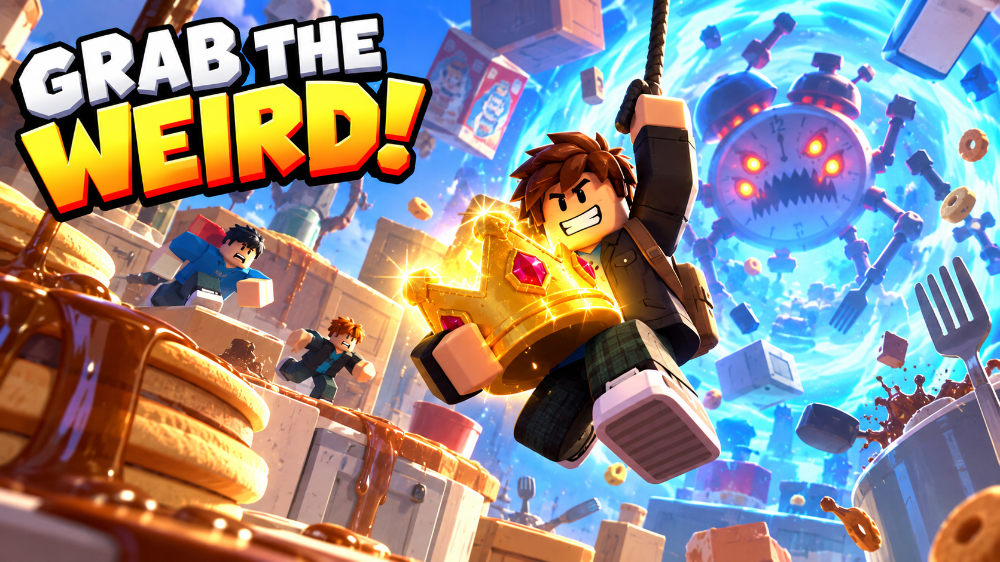
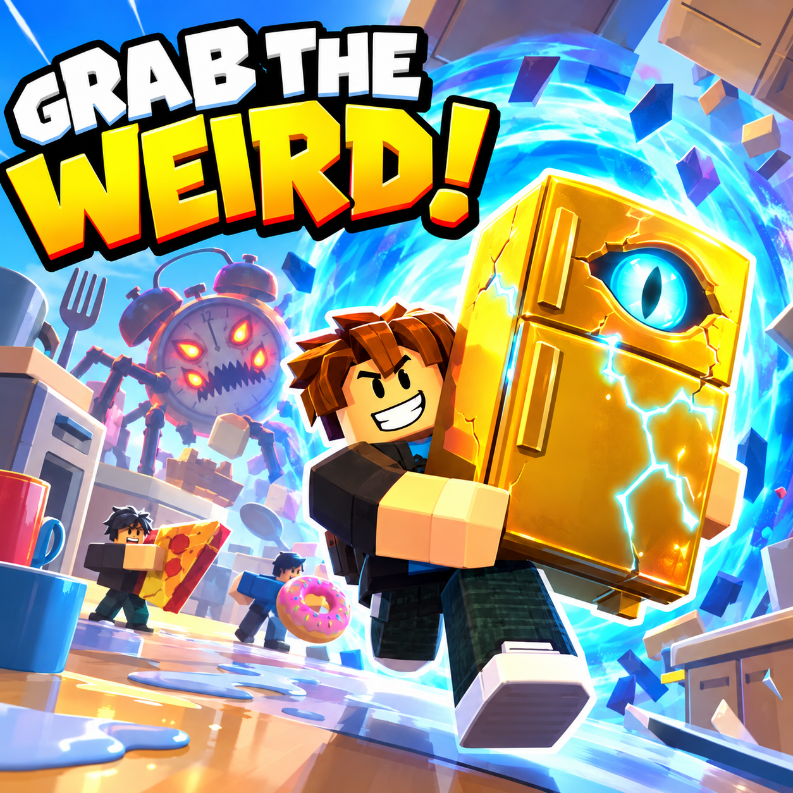

# Art direction / Phase 1

The two user-supplied images are reference artwork for GRAB THE WEIRD!, preserved without redesign. They guide composition and silhouette; they are not runtime textures or Roblox asset IDs.

Use oversized household objects as the visual hook: readable mugs, utensils, cereal boxes and a watchful refrigerator. The kitchen uses cream, warm wood and coral; gold marks aspirational treasure and research accents. Cyan identifies portal travel and extraction. Ink blue grounds the hub's strange-science identity.

Keep the hub welcoming and steady. Make the portal dominate the spawn view. Kitchen landmarks should read from a distance. Keep everyday props broad and toy-like, with simple Roblox materials and little surface noise. The marketing references' dramatic lighting and chaos describe the desired energy; Phase 1 intentionally uses a small static structural kit before the animated kitchen/hazard pass.

Reserve emissive material for portal details and the impossible eye. Do not cover collectibles and ordinary geometry in neon outlines. Keep decorative collision simple and preserve wide carry lanes. No external music, sound, mesh, texture or model IDs have been invented.

Phase 2 should add actual cargo, kitchen mechanisms and rising instability before expanding the dimension count. Moon Aquarium must change movement through low gravity/water; Toybox must change traversal through machinery. Recoloring this kit does not create another dimension.
