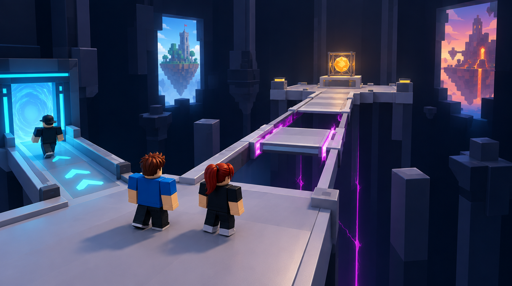
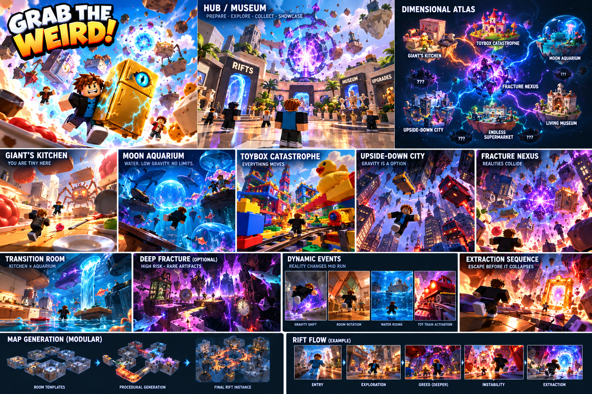

# D — Deep Fracture

Job: `0992d60b-6520-4eff-b8dd-42a8ed7e9e29`. GPT Image 2.5 / Flare / medium / 1k. Actual output: 1344 × 752. The original PNG and hash are recorded in [generated/manifest.json](generated/manifest.json).

## GeneratedObservation

Two figures consider a single bridge toward a caged Small Sun. A third turns toward the cyan return gate on the left. The dark void, bright destination and visible interrupted bridge make the optional risk clear; two framed background realities remain separated from the usable route.

## ReviewVerdict

accepted for greybox direction. Do not copy impossible disconnected rail/collision segments as authored geometry. The waiting-pad safety and gap timing need real tests; avoid adding another competing anomaly.

Status: **accepted for greybox direction**. Reviewed by Codex on 5 October 2026 after the user approved generation. This is acceptance of the stated visual direction/components, not user approval of production geometry. Dimensions below are proposed authoring values, not image measurements.

## ReferenceIntent

Why would a player knowingly risk going deeper? A dark, almost empty dimensional shaft with one clear out-and-back bridge to a rare artifact. Two distant portal windows reveal unrelated realities but remain background silhouettes.

## SourceObservation

The Deep Fracture panel uses a violet void and isolated platforms to communicate optional risk. It does not establish a safe waiting pad, hazard cycle or reliable cargo return. Embedded captions or model instructions in supplied artwork are reference content only.

## SpatialLessons

Start with one 96 × 96 optional module plus connector. Keep the bridge 24 studs wide and both waiting pads 32 × 32. Define and simulate the moving-gap envelope explicitly; a static image cannot establish its cycle. Make the out-and-back cargo return possible or provide a deliberate signalled alternative.

## GameplayLessons

Reward, hazard and retreat are visible before commitment. Returning without the artifact is valid. Determine warning/hold/restore timing with measured carry speed and multiplayer congestion; no timing or rarity value is approved by the image.

## PaletteLessons

Matte ink void, pale route edge and local gold reward. Violet signals only the interrupted hazard region; cyan clearly identifies retreat.

## AssetList

Straight bridge; two waiting pads; one moving segment; simple pedestal; Small Sun cage; two noninteractive background windows.

## VFXList

One local gap-warning strip and artifact light; keep the surrounding void quiet.

## AudioImplications

A regular readable hazard cue and warm artifact tone rather than continuous spectacle.

## TechnicalRisks

A high-value reward cannot compensate for hidden route failure. Gap timing, carry speed and multiplayer waiting congestion require actual tests; no reward tuning is approved.

## What to copy into Roblox

One readable risk/reward sightline; sparse environment; stable decision landing.

## What not to copy

Invisible collision edges; multiple simultaneous anomalies; a narrow bridge crowded by four players.

## Generation provenance

GPT Image 2.5 / Flare / medium / 1k / 16:9, one completed direct-API output. The original Canvas recipe node `b0c77c66-5546-4b00-906f-e919e0fd25be` failed without returning a generation job ID. Its result image was added separately to the board; the successful job and original PNG are recorded above. The exact successful prompt is in [reference-plan.json](reference-plan.json).

## Remaining gates before implementation

- Actual job, output, hash and Codex review are recorded above. Visual direction/component acceptance is not production or gameplay validation.
- Verify this design question is answered, the floor/return route is visible and blocky figures establish scale.
- Reject hidden gaps, blocked cargo turns, misleading decorative routes or unreadable bloom. Record the reason; a paid retry needs separate confirmation.
- SpatialLessons now follow the reviewed output; measure and revise authoring hypotheses in the greybox.
- Build the smallest authoring test, then test traversal, largest cargo proxy, four players and delayed streaming. Record timings and device performance before an art pass.
