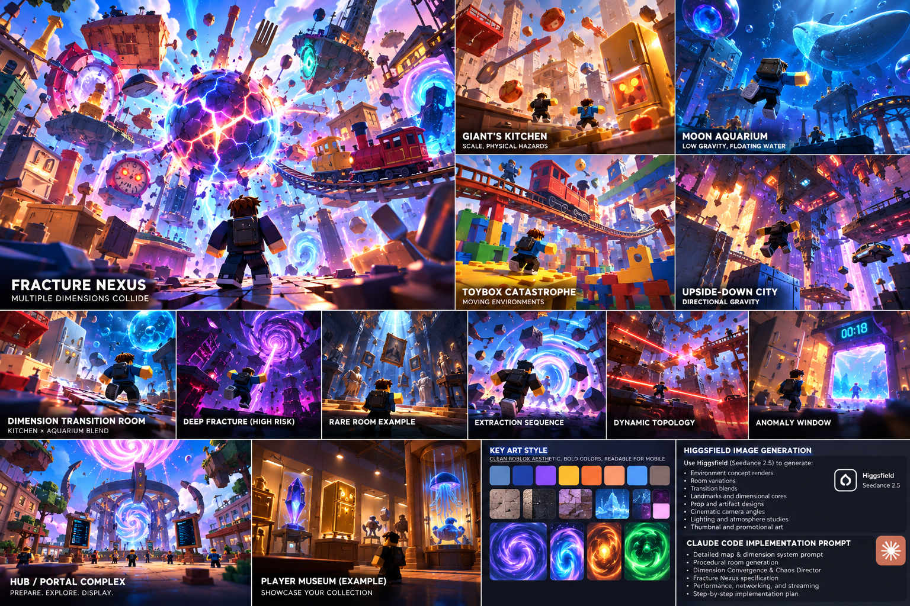

# C — Fracture Core Chamber

Status: **pending generation and review**. No new Higgsfield output exists or is approved. These specifications are initial greybox hypotheses, not measurements inferred from concept art.

## ReferenceIntent

What object does the player remember after leaving? An enormous faceted dimensional reactor split into three readable shell pieces. Architectural fragments orbit inside a contained central shaft. Two levels of chunky catwalks frame the reactor.

## SourceObservation

The main Nexus panel presents a cracked spherical Core framed by oversized objects. It gives a memorable shell silhouette; a traversable multilevel chamber is still a design hypothesis to resolve. Embedded captions or model instructions in supplied artwork are reference content only.

## SpatialLessons

Prototype a 2 × 2 assembly of 96 × 96 modules. Keep a 24-stud lower cargo ring and 32 × 32 turning pads. Place the optional level 16 studs above; target 56-stud visual headroom. These larger relationships require authored assembly and new tests.

## GameplayLessons

The landmark remains visible from every landing. The lower loop remains traversable during the first collapse phase; upper risk must never block the only route home.

## PaletteLessons

Ink/navy structural frame, warm cream walkways, restrained gold clamps, one cyan return portal. Bounded violet/magenta fracture seams may follow the new supplied boards; cyan remains the consistent safe-travel cue. Test silhouettes and floor edges without bloom.

## AssetList

Three Core shell pieces, central shaft frame, lower ring deck, modular side ramp, upper catwalk, gold clamp kit.

## VFXList

Slow shell orbit inside the shaft, seam pulse and one timed warning before upper-platform movement.

## AudioImplications

Layered reactor hum gives proximity and instability information; warning has a clear lead-in.

## TechnicalRisks

Orbiting meshes should be anchored visual animation, not many physics bodies. A falling part must never invalidate the lower route without an alternate extraction route.

## What to copy into Roblox

Three-piece landmark; negative space around the shaft; lower stable loop versus upper optional route.

## What not to copy

Dense spokes that hide players; bloom that erases the Core's silhouette; mandatory narrow jumps.

## Generation proposal

GPT Image 2.5 / Flare / medium / 1k / 16:9, one output. Canvas generation node: `7666f1a3-1c0a-43d3-ada1-2b4b75fc2750`. Prompt and source-image nodes are connected; the Canvas adapter accepts one source-image connection per generation. The exact editable prompt is in [reference-plan.json](reference-plan.json).

## Acceptance before implementation

- Record the actual job ID, output URL, reviewer and verdict after generation. Credit approval alone is not concept approval.
- Verify this design question is answered, the floor/return route is visible and blocky figures establish scale.
- Reject hidden gaps, blocked cargo turns, misleading decorative routes or unreadable bloom. Record the reason; a paid retry needs separate confirmation.
- Rewrite SpatialLessons from the accepted image while distinguishing observations from measured greybox choices.
- Build the smallest authoring test, then test traversal, largest cargo proxy, four players and delayed streaming. Record timings and device performance before an art pass.
