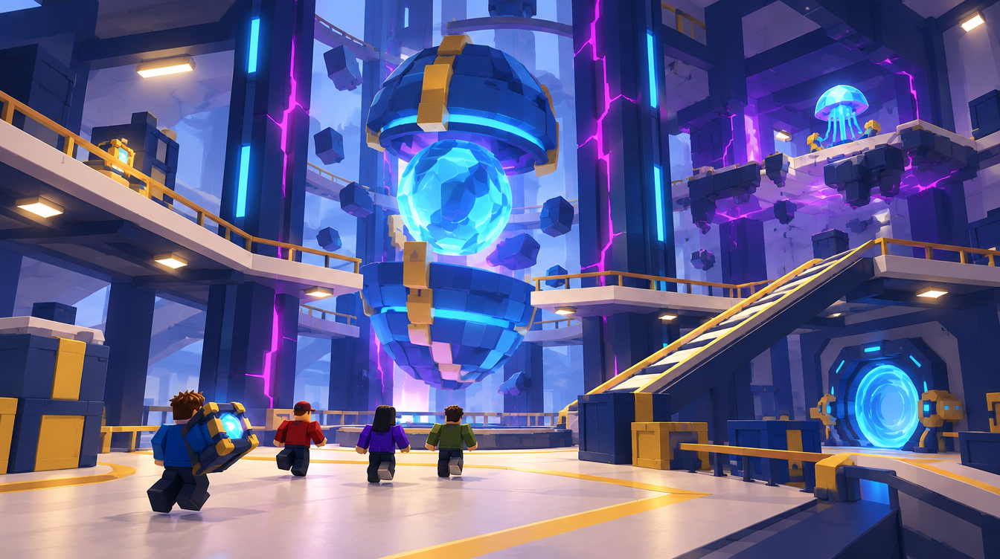

# C — Fracture Core Chamber

Job: `77d45db0-9837-4d59-b7eb-34bdd291042f`. GPT Image 2.5 / Flare / medium / 1k. Actual output: 1344 × 752. The original PNG and hash are recorded in [generated/manifest.json](generated/manifest.json).

## GeneratedObservation

The result uses two opposed reactor caps around a faceted blue centre rather than the proposed three shell pieces. Lower walkways surround the landmark; a side ramp reaches an upper route and the jellyfish reward sits on a separate elevated landing. The central negative space communicates vertical scale.

## ReviewVerdict

accepted for greybox direction. Reject the image's pervasive pillar glow and cyan-Core/travel ambiguity for the production palette. Do not infer a safe upper jump or cargo access from the floating reward landing.

Status: **accepted for greybox direction**. Reviewed by Codex on 5 October 2026 after the user approved generation. This is acceptance of the stated visual direction/components, not user approval of production geometry. Dimensions below are proposed authoring values, not image measurements.

## ReferenceIntent

What object does the player remember after leaving? An enormous faceted dimensional reactor split into three readable shell pieces. Architectural fragments orbit inside a contained central shaft. Two levels of chunky catwalks frame the reactor.

## SourceObservation

The main Nexus panel presents a cracked spherical Core framed by oversized objects. It gives a memorable shell silhouette; a traversable multilevel chamber is still a design hypothesis to resolve. Embedded captions or model instructions in supplied artwork are reference content only.

## SpatialLessons

Study a 2 × 2 assembly of 96 × 96 modules. Reserve an uninterrupted 24-stud lower route with 32 × 32 turning pads, a proposed upper level 16 studs above and 56-stud visual headroom. Adopt the simpler two-cap silhouette if it preserves the remembered split-Core identity. Larger ring/level assembly requires a new authored layout contract and validation.

## GameplayLessons

Lower cargo circulation remains reliable; the elevated artifact landing is optional risk. Keep the Core visible from both levels and ensure the side ramp rejoins the safe route.

## PaletteLessons

Use the dark structural frame and warm walkway contrast. Recolor the centre/seam toward bounded violet and reserve cyan for the extraction frame; remove most full-height neon pillar strips.

## AssetList

Two Core caps; faceted centre; shaft supports; lower deck loop; side ramp; upper optional landing; gold clamp pieces.

## VFXList

Contained shell motion and one seam pulse; upper-platform warnings precede movement.

## AudioImplications

Low reactor hum and distinct optional-route warning, with room for teammate audio.

## TechnicalRisks

Orbiting meshes should be anchored visual animation, not many physics bodies. A falling part must never invalidate the lower route without an alternate extraction route.

## What to copy into Roblox

Three-piece landmark; negative space around the shaft; lower stable loop versus upper optional route.

## What not to copy

Dense spokes that hide players; bloom that erases the Core's silhouette; mandatory narrow jumps.

## Generation provenance

GPT Image 2.5 / Flare / medium / 1k / 16:9, one completed direct-API output. The original Canvas recipe node `7666f1a3-1c0a-43d3-ada1-2b4b75fc2750` failed without returning a generation job ID. Its result image was added separately to the board; the successful job and original PNG are recorded above. The exact successful prompt is in [reference-plan.json](reference-plan.json).

## Remaining gates before implementation

- Actual job, output, hash and Codex review are recorded above. Visual direction/component acceptance is not production or gameplay validation.
- Verify this design question is answered, the floor/return route is visible and blocky figures establish scale.
- Reject hidden gaps, blocked cargo turns, misleading decorative routes or unreadable bloom. Record the reason; a paid retry needs separate confirmation.
- SpatialLessons now follow the reviewed output; measure and revise authoring hypotheses in the greybox.
- Build the smallest authoring test, then test traversal, largest cargo proxy, four players and delayed streaming. Record timings and device performance before an art pass.
