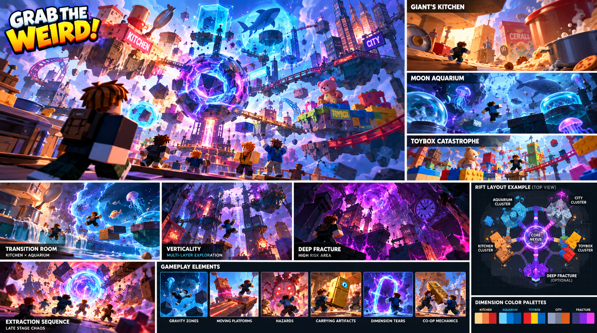

# A — Fracture Nexus — Hero Overview

Status: **pending generation and review**. No new Higgsfield output exists or is approved. These specifications are initial greybox hypotheses, not measurements inferred from concept art.

## ReferenceIntent

What does the entire game mean by dimensions? A fractured research crossing around one central Dimensional Core. Giant's Kitchen counters form the warm left cluster; a broken Moon Aquarium dome forms the cool right cluster; chunky Toybox rails form the upper cluster; an upside-down city is a distant silhouette. Each cluster connects to the Core by a visible broad bridge.

## SourceObservation

The overview and top-view panel show distinct Kitchen, Aquarium, Toybox and City clusters connected around one Core. They suggest a landmark-and-bridges composition, but do not prove cargo widths or reachable paths. Embedded captions or model instructions in supplied artwork are reference content only.

## SpatialLessons

Compose a 3 × 3 study of 96 × 96 modules, not one oversized template. Prototype only the centre and two connected approaches first. Keep 24-stud cargo clearance and 32-stud connectors; leave orbiting silhouettes outside collision and camera lanes.

## GameplayLessons

The Core is the shared navigation anchor. Stable bridges carry cargo; local gravity is introduced only in marked side volumes. An optional loop rejoins the same return route.

## PaletteLessons

Ink-blue Core framing; cream/wood/coral Kitchen; deep navy/pale aqua Aquarium; muted primary Toybox colors; gold artifacts and cyan travel only. Bounded violet/magenta fracture seams may follow the new supplied boards; cyan remains the consistent safe-travel cue. Test silhouettes and floor edges without bloom.

## AssetList

Faceted Core shell, three bridge kits, countertop island, broken dome silhouette, toy rail arch, low-detail upside-down skyline, return gate.

## VFXList

Core seam pulse, one portal plane per destination, restrained rim lighting at dimension boundaries.

## AudioImplications

Stable Core hum near the crossing, distinct ambience from each approach; portal return has a consistent audible cue.

## TechnicalRisks

The multi-module vista requires an authored layout strategy beyond the current fixed eight-room planner. Sightlines across cells, transparent Aquarium surfaces and persistent silhouettes need measured mobile tests.

## What to copy into Roblox

Core silhouette; warm/cool cluster hierarchy; bridges converging on a landmark; coherent return route.

## What not to copy

Decorative orbiting pieces in the carry corridor; a skyline that reads as a reachable route; particles masking bridge edges.

## Generation proposal

GPT Image 2.5 / Flare / medium / 1k / 16:9, one output. Canvas generation node: `a0fd21cc-bc48-498d-b497-94b17263c875`. Prompt and source-image nodes are connected; the Canvas adapter accepts one source-image connection per generation. The exact editable prompt is in [reference-plan.json](reference-plan.json).

## Acceptance before implementation

- Record the actual job ID, output URL, reviewer and verdict after generation. Credit approval alone is not concept approval.
- Verify this design question is answered, the floor/return route is visible and blocky figures establish scale.
- Reject hidden gaps, blocked cargo turns, misleading decorative routes or unreadable bloom. Record the reason; a paid retry needs separate confirmation.
- Rewrite SpatialLessons from the accepted image while distinguishing observations from measured greybox choices.
- Build the smallest authoring test, then test traversal, largest cargo proxy, four players and delayed streaming. Record timings and device performance before an art pass.
