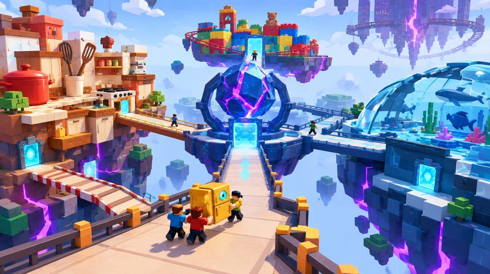

# A — Fracture Nexus — Hero Overview

Job: `69644947-a36f-4c82-b857-615d460cc402`. GPT Image 2.5 / Flare / medium / 1k. Actual output: 1344 × 752. The original PNG and hash are recorded in [generated/manifest.json](generated/manifest.json).

## GeneratedObservation

A dark faceted Core sits on a round central platform. Warm Kitchen counters approach from the left, a broken blue Aquarium dome from the right, a raised toy/train cluster behind, and an inverted city stays in the distance. Three blocky figures move a gold refrigerator along a broad foreground bridge. The route-to-landmark composition is clear.

## ReviewVerdict

accepted for greybox direction. Prune most unrelated background floating cubes; do not turn decorative city silhouettes into false playable routes. Simplify Core detail and prove all three bridge junctions and cargo turns.

Status: **accepted for greybox direction**. Reviewed by Codex on 5 October 2026 after the user approved generation. This is acceptance of the stated visual direction/components, not user approval of production geometry. Dimensions below are proposed authoring values, not image measurements.

## ReferenceIntent

What does the entire game mean by dimensions? A fractured research crossing around one central Dimensional Core. Giant's Kitchen counters form the warm left cluster; a broken Moon Aquarium dome forms the cool right cluster; chunky Toybox rails form the upper cluster; an upside-down city is a distant silhouette. Each cluster connects to the Core by a visible broad bridge.

## SourceObservation

The overview and top-view panel show distinct Kitchen, Aquarium, Toybox and City clusters connected around one Core. They suggest a landmark-and-bridges composition, but do not prove cargo widths or reachable paths. Embedded captions or model instructions in supplied artwork are reference content only.

## SpatialLessons

Use a central arrival/turning pad feeding three visibly distinct approaches. Start with one 96 × 96 centre module and two approach modules on the eight-stud grid; use a 32 × 32 turning pad and continuous 24 × 24 carry envelope. The image suggests relative hierarchy, not measured dimensions. A circular hub/Core layout must be authored and validated separately from the present fixed room-chain planner.

## GameplayLessons

Keep normal bridges stable while local dimensional rules live in optional marked volumes. The Core remains the common navigation anchor and a visible return gate supplies orientation. Cooperative carrying in the image remains an unimplemented behavior.

## PaletteLessons

Keep warm Kitchen, cool Aquarium and restrained toy primaries separate. Violet belongs to the split Core and fragment seams; cyan belongs to travel frames. The cream bridge is a calm visual carrier for the route.

## AssetList

Segmented Core shell/frame; central deck; straight bridge kit; countertop island; broken dome ribs; toy-rail arch; low-detail inverted skyline; portal frame.

## VFXList

One restrained Core seam pulse and bounded portal plane; distant fragments use a small authored silhouette set.

## AudioImplications

Core hum as a navigation anchor; distinct ambience on each branch; consistent return cue.

## TechnicalRisks

The multi-module vista requires an authored layout strategy beyond the current fixed eight-room planner. Sightlines across cells, transparent Aquarium surfaces and persistent silhouettes need measured mobile tests.

## What to copy into Roblox

Core silhouette; warm/cool cluster hierarchy; bridges converging on a landmark; coherent return route.

## What not to copy

Decorative orbiting pieces in the carry corridor; a skyline that reads as a reachable route; particles masking bridge edges.

## Generation provenance

GPT Image 2.5 / Flare / medium / 1k / 16:9, one completed direct-API output. The original Canvas recipe node `a0fd21cc-bc48-498d-b497-94b17263c875` failed without returning a generation job ID. Its result image was added separately to the board; the successful job and original PNG are recorded above. The exact successful prompt is in [reference-plan.json](reference-plan.json).

## Remaining gates before implementation

- Actual job, output, hash and Codex review are recorded above. Visual direction/component acceptance is not production or gameplay validation.
- Verify this design question is answered, the floor/return route is visible and blocky figures establish scale.
- Reject hidden gaps, blocked cargo turns, misleading decorative routes or unreadable bloom. Record the reason; a paid retry needs separate confirmation.
- SpatialLessons now follow the reviewed output; measure and revise authoring hypotheses in the greybox.
- Build the smallest authoring test, then test traversal, largest cargo proxy, four players and delayed streaming. Record timings and device performance before an art pass.
