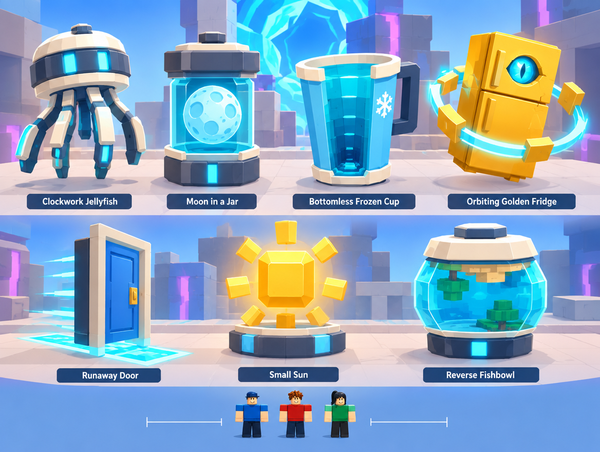

# H — Hybrid Artifact Sheet

Job: `d950c105-8d57-4fa5-9e9e-1552cf4afccf`. GPT Image 2.5 / Flare / medium / 1k. Actual output: 1168 × 880. The original PNG and hash are recorded in [generated/manifest.json](generated/manifest.json).

## GeneratedObservation

The sheet contains all seven requested names and distinct large-piece silhouette families. The jellyfish uses a bell and repeated mechanical limbs; jar/cup/bowl use contained volumes; fridge uses a bounded orbit; Small Sun is faceted. Tiny figures and blank ruler marks at the bottom do not establish reliable object dimensions. The sheet's Runaway Door lacks the wheeled feet shown in F.

## ReviewVerdict

accepted silhouettes only. Reject unlabelled ruler ticks as measurements and exclude text labels from runtime assets. Add explicit contact geometry; the reverse fishbowl behavior and cooperative fridge carry are unproved by a static sheet.

Status: **accepted silhouettes only**. Reviewed by Codex on 5 October 2026 after the user approved generation. This is acceptance of the stated visual direction/components, not user approval of production geometry. Dimensions below are proposed authoring values, not image measurements.

## ReferenceIntent

How do artifacts show their dimensional history? A clean seven-object concept sheet: Clockwork Jellyfish, Moon in a Jar, Bottomless Frozen Cup, Orbiting Golden Fridge, Runaway Door, Small Sun, Reverse Fishbowl. Each is a chunky Roblox-buildable assembly with no tiny filigree.

## SourceObservation

The supplied icon establishes a gold refrigerator silhouette, a cyan eye, blocky figure proportions and cooperative artifact fantasy. It did not establish a dedicated seven-object sheet; the generated study now covers those other silhouettes above. Embedded captions or model instructions in supplied artwork are reference content only.

## SpatialLessons

Use explicit proposed proxies in studs, independent of the picture's fake ruler: jellyfish 8 × 8 × 8; jar 8 × 12 × 8; cup 8 × 10 × 8; fridge 16 × 20 × 12; door 12 × 20 × 4; sun cage 8 × 8 × 8; bowl 12 × 12 × 12. Validate the combined carrier/object envelope against 24 × 24 routes. Preserve contact/grasp points and use simple collision proxies.

## GameplayLessons

Accept silhouette vocabulary, not weights, rarity, economics or physical behavior. Add authored grasp/handle points, bounded orbit limits and wheeled-door feet based on F where appropriate. Cosmetic motion never expands authoritative carrying collision unpredictably.

## PaletteLessons

Copy limited cream/ink/steel families and gold fridge/sun. Reduce repeated cyan strips and contained-water transparency; eye/water details may be accents without making every artifact read as a portal.

## AssetList

Seven primitive-first proxies; shared scale rig; grasp/contact markers; bounded orbit pieces; simple materials and palette sheet.

## VFXList

At most one bounded effect per object, with distance-limited museum display behavior.

## AudioImplications

One short recognizable motif per behavior; avoid seven competing continuous display loops.

## TechnicalRisks

Transparent contents, cooperative carry and autonomous motion complicate replication. Check grasp points, collision proxy, drop/recovery behavior and distance-based display simulation before any production adoption.

## What to copy into Roblox

Distinct silhouette families; limited materials; clear carrying scale and contact points.

## What not to copy

Tiny gears and cloth tentacles; labels posing as game UI; detailed PBR textures; behavior concealed by a generic glow.

## Generation provenance

GPT Image 2.5 / Flare / medium / 1k / 4:3, one completed direct-API output. The original Canvas recipe node `594b9e43-f25d-4108-9fe1-2601103108e6` failed without returning a generation job ID. Its result image was added separately to the board; the successful job and original PNG are recorded above. The exact successful prompt is in [reference-plan.json](reference-plan.json).

## Remaining gates before implementation

- Actual job, output, hash and Codex review are recorded above. Visual direction/component acceptance is not production or gameplay validation.
- Verify this design question is answered, the floor/return route is visible and blocky figures establish scale.
- Reject hidden gaps, blocked cargo turns, misleading decorative routes or unreadable bloom. Record the reason; a paid retry needs separate confirmation.
- SpatialLessons now follow the reviewed output; measure and revise authoring hypotheses in the greybox.
- Build the smallest authoring test, then test traversal, largest cargo proxy, four players and delayed streaming. Record timings and device performance before an art pass.

## Studio translation — 5 October 2026

The user subsequently requested an in-game illustration. Native geometry now implements `Workspace.OddvaultWorld.Hub.ArtifactGallery (seven display models)`. See [the map and evidence](../NEXUS_MAP_ILLUSTRATION.md) for the actual layout, clearance samples and one-client walkthrough. This implements the visual composition; the GameplayLessons remain proposals until their rules, carrying, multiplayer and performance checks are implemented.
