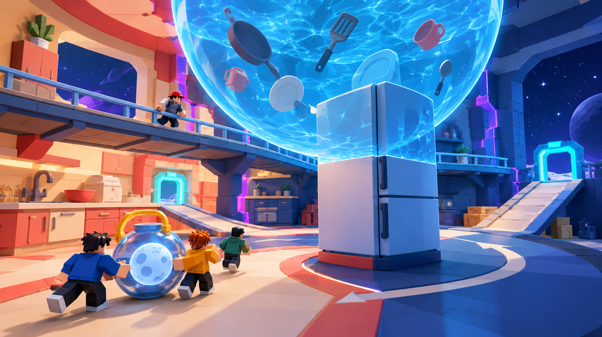

# B — Kitchen × Moon Aquarium Transition

Job: `d6e674e7-6fda-4ebb-b9a8-65d0af975d37`. GPT Image 2.5 / Flare / medium / 1k. Actual output: 1344 × 752. The original PNG and hash are recorded in [generated/manifest.json](generated/manifest.json).

## GeneratedObservation

One spherical water volume intersects the upper refrigerator and ceiling. Warm kitchen surfaces and blue Aquarium masonry share the same room. Loose utensils sit inside the water volume; a raised catwalk passes behind the fridge. A continuous dry floor and a visible right-hand ramp support the carry route.

## ReviewVerdict

accepted for greybox direction. Do not copy the centre fridge into the validated straight lanes. Simplify stacked glass/water; retain one sphere visual and one behavior volume. The right ramp must be cargo-rated only after physical testing.

Status: **accepted for greybox direction**. Reviewed by Codex on 5 October 2026 after the user approved generation. This is acceptance of the stated visual direction/components, not user approval of production geometry. Dimensions below are proposed authoring values, not image measurements.

## ReferenceIntent

How do two dimensions physically bleed into each other? An oversized kitchen counter enters a cracked orbital Aquarium wall. A single spherical volume of water hangs across the ceiling; the top half of a chunky refrigerator intersects the water while its base stays on the floor. Stars are visible through one bounded wall opening.

## SourceObservation

The Kitchen × Aquarium panel combines warm kitchen architecture with cool water at the same seam. A continuous dry heavy-cargo floor is not established by the image, so the proposed study explicitly adds one. Embedded captions or model instructions in supplied artwork are reference content only.

## SpatialLessons

Prototype a 96 × 96 module. Keep a straight 24 × 24 lower cargo lane compatible with current socket validation; move the refrigerator into a corner quadrant rather than copying its central obstruction. Test a 24-stud sphere centered at 28 studs with a 40-stud visual ceiling; a 16-stud catwalk is optional and not cargo-rated. These are proposed authoring values, not image measurements.

## GameplayLessons

Use one tagged upper anomaly volume for suspended-water/low-gravity behavior. The lower carry lane stays dry and stable. Test whether the upper shortcut offers a deliberate advantage before adding physics or loot.

## PaletteLessons

Copy the warm/cool seam and restrained violet boundary. Reduce water-surface contrast and transparency layering so the actual floor and artifact stay readable.

## AssetList

Counter deck; fridge shell; one water-sphere visual; cracked dome wall ribs; catwalk; gentle ramp; Moon-in-a-Jar proxy.

## VFXList

Bounded water surface, local seam and a few constrained utensil motions; no full-room particle cloud.

## AudioImplications

Water resonance in the anomaly and ordinary Kitchen ambience below; one clear boundary-crossing cue.

## TechnicalRisks

Nested transparency can hide cargo and hurt mobile rendering. Water and local-gravity behavior are unimplemented; use a noncolliding visual and a tagged volume before any physics experiment.

## What to copy into Roblox

A shared support and spatial seam; dry route below the anomaly; refrigerator silhouette for scale.

## What not to copy

Flooding both exits; transparent surfaces stacked across the player camera; rotating heavy-cargo bridges.

## Generation provenance

GPT Image 2.5 / Flare / medium / 1k / 16:9, one completed direct-API output. The original Canvas recipe node `94e6e68c-f7d7-458a-89de-1f36bcdc433c` failed without returning a generation job ID. Its result image was added separately to the board; the successful job and original PNG are recorded above. The exact successful prompt is in [reference-plan.json](reference-plan.json).

## Remaining gates before implementation

- Actual job, output, hash and Codex review are recorded above. Visual direction/component acceptance is not production or gameplay validation.
- Verify this design question is answered, the floor/return route is visible and blocky figures establish scale.
- Reject hidden gaps, blocked cargo turns, misleading decorative routes or unreadable bloom. Record the reason; a paid retry needs separate confirmation.
- SpatialLessons now follow the reviewed output; measure and revise authoring hypotheses in the greybox.
- Build the smallest authoring test, then test traversal, largest cargo proxy, four players and delayed streaming. Record timings and device performance before an art pass.
