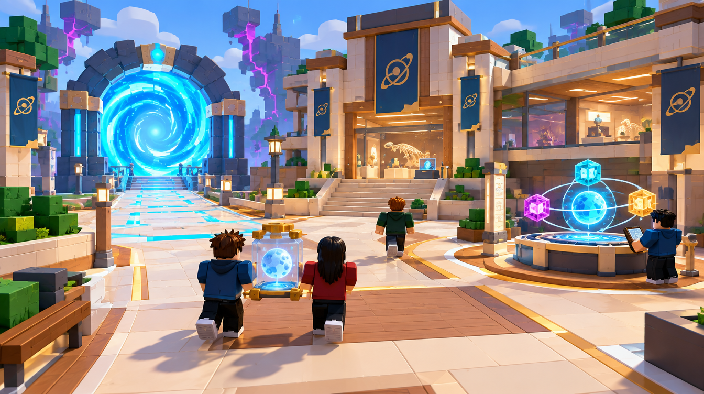

# G — Portal Hub / Dimensional Atlas

Job: `d8728dec-c2ce-45f5-998e-ce95041e4092`. GPT Image 2.5 / Flare / medium / 1k. Actual output: 1344 × 752. The original PNG and hash are recorded in [generated/manifest.json](generated/manifest.json).

## GeneratedObservation

The primary gate dominates the left approach. A museum/research facade gives a visible home destination, while a three-node Atlas occupies a side plinth. Two figures bring a jar artifact toward the plaza. The museum entrance is reached by stairs, so the image does not supply a proven heavy-cargo route into the gallery.

## ReviewVerdict

accepted composition only. Add reliable cargo access to the museum before accepting the layout. Remove unnecessary floating backdrop pieces and avoid presenting three Atlas nodes as already functional progression.

Status: **accepted composition only**. Reviewed by Codex on 5 October 2026 after the user approved generation. This is acceptance of the stated visual direction/components, not user approval of production geometry. Dimensions below are proposed authoring values, not image measurements.

## ReferenceIntent

What does coming home feel like? A stable research plaza with one huge primary Rift gate, a simple physical Dimensional Atlas showing three discovered nodes, and a visible museum/research wing.

## SourceObservation

The Hub / Museum panel uses a central portal landmark and a research/gallery plaza. The supplied boards also show an Atlas and museum displays; these are direction for future features, not current gameplay. Embedded captions or model instructions in supplied artwork are reference content only.

## SpatialLessons

Preserve the existing 224-stud plaza context, a 32-stud arrival lane and 32 × 32 turning pad. Keep Atlas users beside the lane. Replace the depicted museum stair-only approach with a level gallery entrance or a separately tested broad ramp; a proposed 48 × 48 bay is only an authoring target.

## GameplayLessons

Accept safe-home composition, landmark placement and side-station separation. Reject the stair-only cargo layout as a direct implementation plan. Atlas discoveries, museum placement and persistence are future features, not active Phase 1 progression.

## PaletteLessons

Warm cream/gold plaza and ink research masses; cyan travel, limited Atlas projection. Keep distant violet fragments subordinate to stable home.

## AssetList

Primary gate; level/ramped gallery entrance; small Atlas plinth/rings; research counters; display bays; arrival pad.

## VFXList

Bounded Atlas projection, one gate plane and mild display highlight; no full-plaza glow.

## AudioImplications

Warm stable ambience and return resolution cue; discovery sounds belong to implemented events.

## TechnicalRisks

Atlas nodes and museum displays must not imply active progression in the present Phase 1 build. Avoid crowding arrival and the join prompt; profile display behavior before persistence work.

## What to copy into Roblox

Stable composition; portal-first orientation; quiet museum destination; warm home lighting.

## What not to copy

Huge UI holograms masking players; fake active discovery UI; physics-enabled artifacts left to accumulate.

## Generation provenance

GPT Image 2.5 / Flare / medium / 1k / 16:9, one completed direct-API output. The original Canvas recipe node `6f07eeaa-2321-4c28-b6d8-86028189286b` failed without returning a generation job ID. Its result image was added separately to the board; the successful job and original PNG are recorded above. The exact successful prompt is in [reference-plan.json](reference-plan.json).

## Remaining gates before implementation

- Actual job, output, hash and Codex review are recorded above. Visual direction/component acceptance is not production or gameplay validation.
- Verify this design question is answered, the floor/return route is visible and blocky figures establish scale.
- Reject hidden gaps, blocked cargo turns, misleading decorative routes or unreadable bloom. Record the reason; a paid retry needs separate confirmation.
- SpatialLessons now follow the reviewed output; measure and revise authoring hypotheses in the greybox.
- Build the smallest authoring test, then test traversal, largest cargo proxy, four players and delayed streaming. Record timings and device performance before an art pass.
