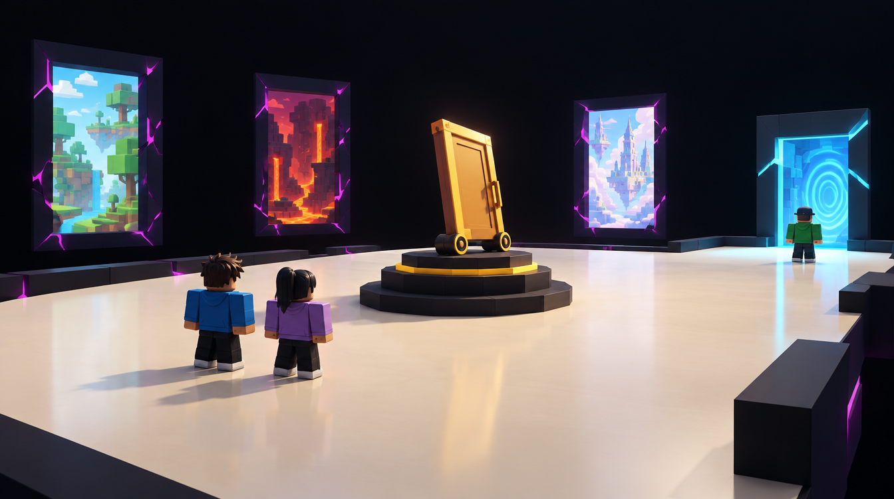

# F — Rare Room — Between Dimensions

Job: `dfd76add-c731-494d-a299-046d46ac7151`. GPT Image 2.5 / Flare / medium / 1k. Actual output: 1344 × 752. The original PNG and hash are recorded in [generated/manifest.json](generated/manifest.json).

## GeneratedObservation

A plain ivory platform surrounds one raised wheeled-door pedestal. Three distant framed views into unrelated worlds contrast with one cyan return doorway. Two figures contemplate the artifact and one waits at the return. Quiet negative space creates rarity without chaos.

## ReviewVerdict

accepted for greybox direction. Do not make every background frame look equally usable. No physics behavior or drop-recovery guarantee can be inferred from the wheeled pedestal pose.

Status: **accepted for greybox direction**. Reviewed by Codex on 5 October 2026 after the user approved generation. This is acceptance of the stated visual direction/components, not user approval of production geometry. Dimensions below are proposed authoring values, not image measurements.

## ReferenceIntent

How does rarity become memorable through contrast? An almost empty impossible ivory/black void with a single solid platform, one strange artifact and three distant framed doorways into unrelated dimensions.

## SourceObservation

The Rare Room Example panel uses tall door-like objects and sparse floor space. The almost-empty ivory/black room proposed here is an intentional contrast experiment, not an observed feature of that supplied panel. Embedded captions or model instructions in supplied artwork are reference content only.

## SpatialLessons

Use one mostly empty 96 × 96 module. Put a proposed 16 × 16 pedestal off a straight 24-stud carry lane, with 24-stud clear headroom. Keep three background frames and one usable return on the same continuous floor. Round plinth detail may be simplified to a few primitive rings.

## GameplayLessons

Approach and withdrawal remain obvious. A future Runaway Door behavior must stay bounded on the accessible floor; background views are not interactive exits until actually implemented.

## PaletteLessons

Ivory/ink contrast and a small gold artifact focus; violet frame seams are secondary to cyan return. Replace the highly reflective floor with a readable simple material if glare hides edges.

## AssetList

Plain floor; simple offset pedestal; wheeled-door proxy; three view frames; active return frame.

## VFXList

Active return plane and mild artifact highlight only; preserve quiet contrast.

## AudioImplications

Low room tone and a soft distinct door mechanism; reduce density after the preceding chaotic room.

## TechnicalRisks

Bright void exposure can erase floor edges. Test contrast and touch-camera readability; an animated artifact needs a bounded behavior so it cannot leave the accessible floor.

## What to copy into Roblox

Negative space; one memorable object; rare calm; unmistakable physical floor.

## What not to copy

Explosion spectacle; decorative stepping stones; every distant door looking equally interactable.

## Generation provenance

GPT Image 2.5 / Flare / medium / 1k / 16:9, one completed direct-API output. The original Canvas recipe node `a77069fa-5bc0-4455-a68a-45263307cbb4` failed without returning a generation job ID. Its result image was added separately to the board; the successful job and original PNG are recorded above. The exact successful prompt is in [reference-plan.json](reference-plan.json).

## Remaining gates before implementation

- Actual job, output, hash and Codex review are recorded above. Visual direction/component acceptance is not production or gameplay validation.
- Verify this design question is answered, the floor/return route is visible and blocky figures establish scale.
- Reject hidden gaps, blocked cargo turns, misleading decorative routes or unreadable bloom. Record the reason; a paid retry needs separate confirmation.
- SpatialLessons now follow the reviewed output; measure and revise authoring hypotheses in the greybox.
- Build the smallest authoring test, then test traversal, largest cargo proxy, four players and delayed streaming. Record timings and device performance before an art pass.

## Studio translation — 5 October 2026

The user subsequently requested an in-game illustration. Native geometry now implements `Workspace.OddvaultWorld.DimensionMap.RoomBetweenDimensions`. See [the map and evidence](../NEXUS_MAP_ILLUSTRATION.md) for the actual layout, clearance samples and one-client walkthrough. This implements the visual composition; the GameplayLessons remain proposals until their rules, carrying, multiplayer and performance checks are implemented.
