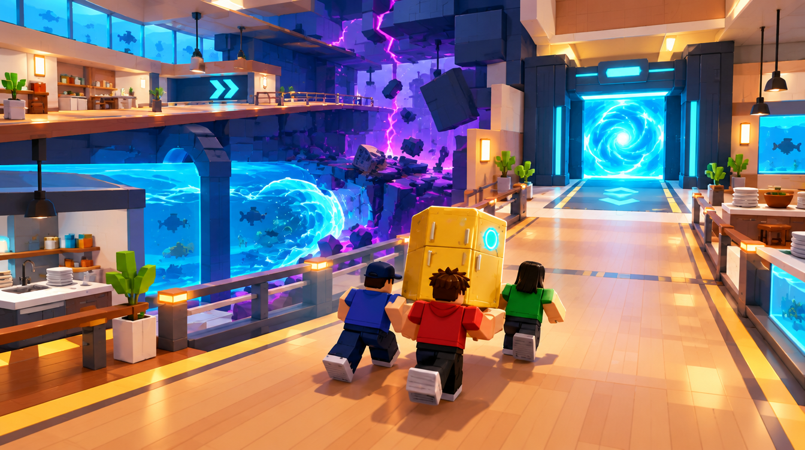
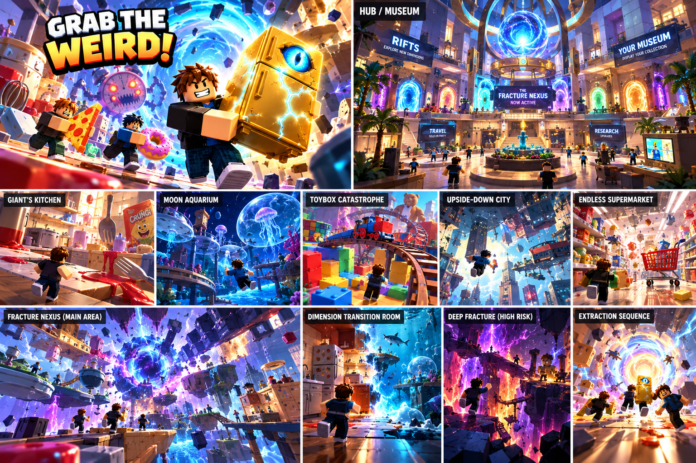

# E — Total Fracture Escape

Job: `f5be0a02-d76c-42eb-b98e-a05bfc5efe24`. GPT Image 2.5 / Flare / medium / 1k. Actual output: 1344 × 752. The original PNG and hash are recorded in [generated/manifest.json](generated/manifest.json).

## GeneratedObservation

Three blocky figures carry the refrigerator on a wide warm deck toward a large cyan extraction frame. The side/upper route visibly breaks apart behind them while water remains below the safe deck. Feet, floor and destination are all readable.

## ReviewVerdict

accepted for greybox direction. Do not treat rendered arrows as sufficient navigation or copy side-route destruction into the only cargo path. The still image does not establish high-intensity motion, timing or server-safe topology change.

Status: **accepted for greybox direction**. Reviewed by Codex on 5 October 2026 after the user approved generation. This is acceptance of the stated visual direction/components, not user approval of production geometry. Dimensions below are proposed authoring values, not image measurements.

## ReferenceIntent

What does the strongest OH-NO moment look like? A Kitchen/Aquarium crossover collapses behind three blocky players carrying one bulky artifact. One emergency extraction gate is ahead, framed by solid dark supports. A bounded water anomaly moves beside the failing secondary route.

## SourceObservation

The Extraction Sequence panel puts a strong portal ahead of fleeing players. The readable path, cooperative cargo envelope and collapse timing still need a dedicated study. Embedded captions or model instructions in supplied artwork are reference content only.

## SpatialLessons

Prototype three connected 96 × 96 modules. Reserve a continuous 24 × 24 return envelope and a 32 × 32 gate turning/queue pad. Put sacrificial geometry beside or behind that route. A proposed 32-second escape with eight seconds of warning is only a tuning hypothesis; measure actual heavy-cargo completion before choosing timing.

## GameplayLessons

Collapse removes optional space first. Keep a surviving bypass visible until the escape window ends and verify four-player queue behavior. Current runtime expiry is not this collapse mechanic.

## PaletteLessons

Keep cream/wood return deck calm, violet fracture behind it and cyan at the goal. Reduce the bright water vortex so it does not compete with extraction.

## AssetList

Intact deck; sacrificial side deck; emergency gate; turning/queue pad; bounded water visual; refrigerator proxy.

## VFXList

One local fracture seam and bounded side debris; portal pulse remains the strongest travel cue.

## AudioImplications

Readable warning and rising collapse rhythm, with extraction cue and teammate speech still audible.

## TechnicalRisks

The current package has only expiry/diagnostic instability, not collapse or carrying. This is a future behavior brief; server state, streaming availability and return path guarantees must precede effects.

## What to copy into Roblox

Collapse direction; surviving cargo path; emergency gate visibility; readable feet and floor.

## What not to copy

Particle walls; all routes failing simultaneously; camera shake used to hide poor navigation.

## Generation provenance

GPT Image 2.5 / Flare / medium / 1k / 16:9, one completed direct-API output. The original Canvas recipe node `57ab67e8-2098-45df-8bc5-cfc3066d78ad` failed without returning a generation job ID. Its result image was added separately to the board; the successful job and original PNG are recorded above. The exact successful prompt is in [reference-plan.json](reference-plan.json).

## Remaining gates before implementation

- Actual job, output, hash and Codex review are recorded above. Visual direction/component acceptance is not production or gameplay validation.
- Verify this design question is answered, the floor/return route is visible and blocky figures establish scale.
- Reject hidden gaps, blocked cargo turns, misleading decorative routes or unreadable bloom. Record the reason; a paid retry needs separate confirmation.
- SpatialLessons now follow the reviewed output; measure and revise authoring hypotheses in the greybox.
- Build the smallest authoring test, then test traversal, largest cargo proxy, four players and delayed streaming. Record timings and device performance before an art pass.

## Studio translation — 5 October 2026

The user subsequently requested an in-game illustration. Native geometry now implements `Workspace.OddvaultWorld.DimensionMap.ExtractionDeck`. See [the map and evidence](../NEXUS_MAP_ILLUSTRATION.md) for the actual layout, clearance samples and one-client walkthrough. This implements the visual composition; the GameplayLessons remain proposals until their rules, carrying, multiplayer and performance checks are implemented.
